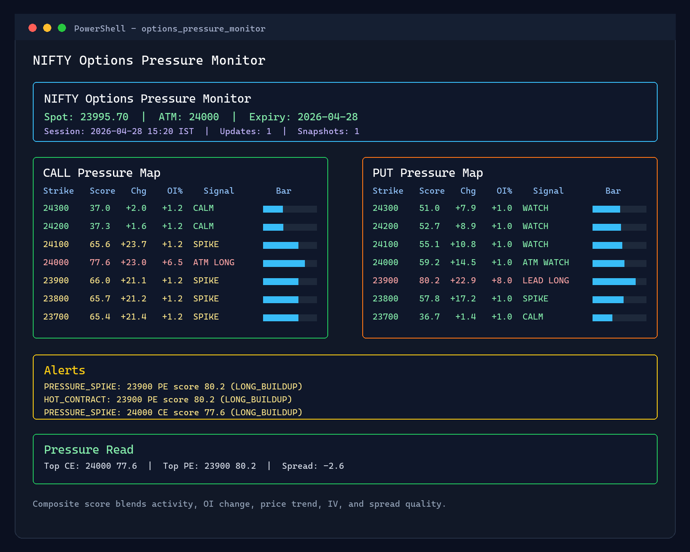
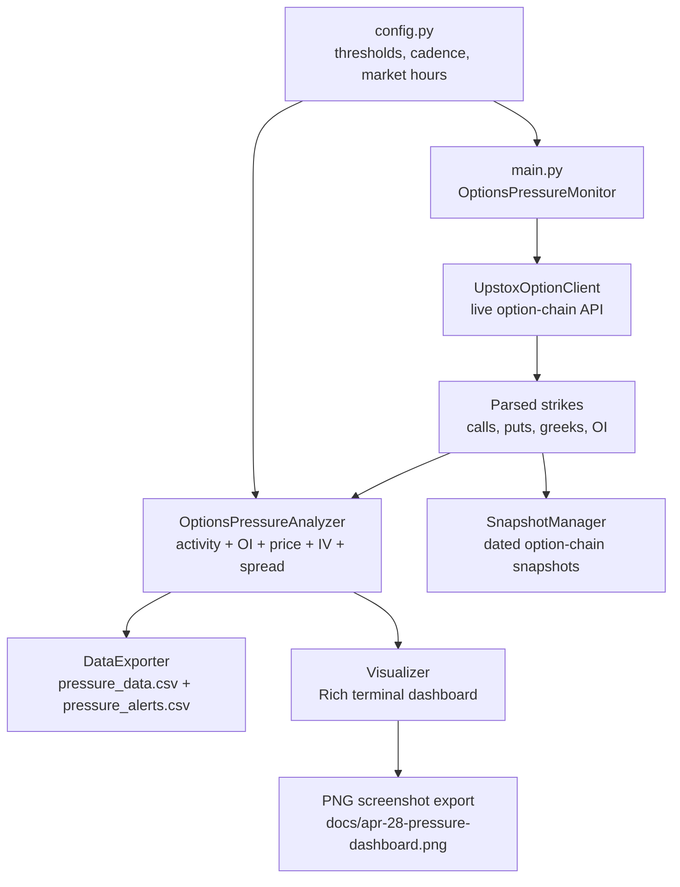

# NIFTY Options Pressure Monitor

A real-time terminal dashboard for ranking NIFTY 50 option contracts by composite market pressure. Instead of relying on a single volume/open-interest ratio, it blends activity, open-interest change, price movement, implied volatility, and spread quality into one readable pressure score.

> This project is for market monitoring and research. It is not financial advice.

## Terminal Preview



## Architecture



## Project Layout

```text
.
|-- main.py                    # Live Upstox orchestration and CLI
|-- pressure_analyzer.py       # Composite pressure scoring engine
|-- api_client.py              # Upstox option-chain API wrapper
|-- auth_manager.py            # Upstox token/cache flow
|-- visualizer.py              # Rich dashboard and PNG screenshot export
|-- data_exporter.py           # Pressure CSV writers
|-- snapshot_manager.py        # Full option-chain snapshot writer
|-- config.py                  # Runtime configuration
|-- credentials.example.json
|-- requirements.txt
`-- docs/
    `-- apr-28-pressure-dashboard.png
```

## Requirements

- Python 3.10 or newer
- Upstox developer credentials for live mode
- Optional Cloudflare Worker endpoint if you use the token polling flow in `auth_manager.py`

## Setup

```powershell
git clone https://github.com/markovnikov314/options_pressure_monitor.git
cd options_pressure_monitor
python -m venv .venv
.\.venv\Scripts\Activate.ps1
pip install -r requirements.txt
```

Create local credentials for live mode:

```powershell
Copy-Item credentials.example.json credentials.json
```

Edit `credentials.json` with your Upstox `client_id`, `client_secret`, and optional `worker_url`.

You can also provide a token directly:

```powershell
$env:UPSTOX_ACCESS_TOKEN = "your-access-token"
```

Or pass it for a single run:

```powershell
python main.py --token "your-access-token"
```

## Run Live

```powershell
python main.py
```

The app starts a terminal dashboard, refreshes every `UPDATE_INTERVAL_SECONDS`, and writes local CSV output. Stop it with `Ctrl+C`.

Capture one live update and save a screenshot:

```powershell
python main.py --once --screenshot docs/live-dashboard.png
```

## Configuration

Most runtime settings live in `config.py`.

| Setting | Purpose |
| --- | --- |
| `INSTRUMENT_KEY` | Upstox instrument key, default `NSE_INDEX|Nifty 50` |
| `STRIKE_INTERVAL` | Strike rounding interval for ATM selection |
| `STRIKE_RANGE` | Points above and below ATM to monitor |
| `UPDATE_INTERVAL_SECONDS` | Refresh cadence |
| `LOOKBACK_PERIODS` | Rolling periods used for trend comparison |
| `PRESSURE_HOT_THRESHOLD` | Score at which a contract is treated as hot |
| `PRESSURE_WATCH_THRESHOLD` | Score at which a contract enters watch state |
| `PRESSURE_SPIKE_THRESHOLD` | Positive score change that creates a spike alert |
| `PRESSURE_FADE_THRESHOLD` | Negative score change that creates a fade alert |
| `RUN_ONLY_DURING_MARKET_HOURS` | Whether live mode waits for NSE market hours |

## Outputs

| File or folder | Description |
| --- | --- |
| `pressure_data.csv` | Detailed strike-level pressure rows |
| `pressure_alerts.csv` | Hot contract, spike, fade, and leader-shift alerts |
| `snapshots/YYYY-MM-DD/snapshot_HH-MM-SS.csv` | Full option-chain snapshots with greeks |
| `options_pressure_monitor.log` | Runtime log file |

## Authentication Notes

`AuthManager` tries credentials in this order:

1. Same-day cached token from `token_cache.json`.
2. `UPSTOX_ACCESS_TOKEN` from the environment.
3. Token request plus polling through the configured Cloudflare Worker URL.
4. Manual token entry in the terminal.
